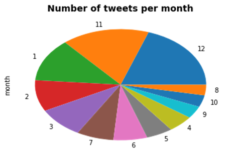
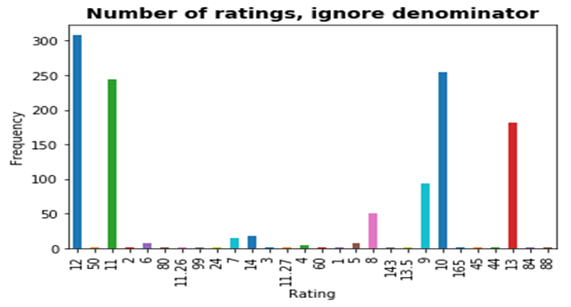

This is the report of my wrangling effort. In this project, I was doing data wrangling with dogs’ data set. Data wrangling consists of gathering, assessing, and cleaning data for the purpose of completing the fifth project at Data Analysis Udacity Nanodegree.

### Data Wrangling
**Gather:** There are three files that I need to gather so as to complete this project
-	Twitter-Archive:I received the twitter_archive_enhanced.csv through Udacity project detail and it can be accessed/interpreted using panda framework.
-	Image-Predictions: This file is hosted on Udacity's server and I used Python's requests to get accessed. Unlike csv, this file is a tsv file with tab ("\t") as delimiters. 
-	Json-tweets.csv: In order to do this, I first had to get a twitter developer account and its API keys to query data. Then, using a self- made 'seperate_tweet' function to filter out only tweets with a tweet ID. Next, I converted json object to a dictionary and saved it to 'json_tweets.txt' file. Having that file, I then reopen it, get tweet_id, favorite and retweet count and put it in a data frame using Panda. 

**Assess:**
-	The first thing I always do when it comes to assessing a data frame is to overview it using df.head() and df.info() to check columns' heading as well as data type for each column.
-	Next, I drop columns and rows that contain a lot of Nan, which is known as null value, or columns that I will not use or not related to the data set.
-	I will make the data set cleaner and more accurate with df.dropna(inplace = True) to get rid of all rows with Nans value.
-	I also checked for messy data such as duplicated by using df.duplicated().sum() and using drop_duplicate() if needed.
-	I then check for each column data type and cast it to the right one if necessary. 
-	The most important thing, make note of what needs to be changed.

**Cleaning:**
-	Before I started cleaning, I made a copy of the original one to keep it clear of what I did and to avoid re-running the whole thing if mistakes are made. I will only make changes to the copy versions. 
-	I used a markdown cell to describe what feature I am making change to, followed by a code cell to make the change happen. I then double check it with another code cell to test my change.
-	I follow through with my "what needs to be changed" note and that speeds up the process and leaves nothing undone behind. 
-	I then merge my data sets since it share the same ‘tweet-id’
-	After finish cleaning up, I will re-inspect my final data set to make sure everything is good, the data is clean and tidy

**Storing:**
-	I then convert it to a csv and store it in the same directory with the other files.

### Data Visualization

**Insight 1:**
In my visualization project, I realized a few things. Using the data, I was able to deduce the 3 most popular dog breeds in relation to the tweets posted. The most popular one is Golden Retriever coming in at about 200 appearances followed by Pembroke (Corgi) and Labrador. 
I can explain the relation as to why Labrador is among the top three. Since golden retriever is the most popular and labrador is a non-furred version of them, it makes sense that it would also be popular. Contrary to my research, if we look at the United State alone, Labrador is more popular than Golden Retriever. I think other countries have factored into the popularity of the breed in relation to the tweet as well.

The corgi has recently become popular properly due to the queen of England’s love for one. Also, many people view corgi as a representation of them as well (short and clumsy). 

**Insight 2:**
Another thing I notice is the months with the most tweets. December comes first followed by November and January. I think the reason for these results having to do with users having more free time. I noticed that these months are the months of popular holiday all around the world. December has the most tweets because Christmas is popular anywhere in the world. 

**Insight 3:**
The next thing I notice is the rating for each dog. These ratings are just for fun. I don’t think they are rated based on any particular set of features. However, it is interesting that the number 12/10 is the most commonly used rating. I don’t have an explanation of it. Maybe 12 is just a popular number?

